# Social Worlds
This is a [ROS](www.ros.org) package that contains a set of [gazebo](http://gazebosim.org/) worlds, plugins and nodes integrated with the [OpenAI Gym](https://gym.openai.com/) toolkit. This sets provides environments for a robot to learn social behaviors.

## Dependencies:
* [gazebo](http://gazebosim.org/) (9.0.0)
* [ROS](https://www.ros.org/) (Melodic Morenia)
* [OpenAI Gym](https://gym.openai.com/) (??)

## Models:
The models used in this package was developed by the author or imported from [3D Gazebo Models](http://data.nvision2.eecs.yorku.ca/3DGEMS/) and [OSRF Gazebo Models](https://github.com/osrf/gazebo_models).

## MSG and SRV:
* **Region.msg**: Used to store a region representation with the region name and a set of points inside the region.
```
  string name
  geometry_msgs/Point[] points
```

* **ActorTrajectory.srv**: Used to request a actor to follow a determined pathway.
```
  std_msgs/String animation
  geometry_msgs/Pose[] waypoints
  ---
```

* **Regions.srv**: Used to request the set o regions available in a world.
```
  ---
  social_worlds/Region[] regions
```

<!-- * **Start.srv**: used to start a task script and referee
```
  ---
``` -->

## Nodes:
* **check_region_node**: Node used to check if a region is occupied by a model.
* **real_time_factor_publisher_node**: Node used to publish the gazebo real_time_factor on ROS ecosystem.

## plugins:
* **region**: Define regions in the world and provide a service to get points in this regions.
  * ex.:
  ```
    <plugin name="path" filename="lib_regions.so">
      <region name="start">
        <layer>1</layer>
        <color>Green</color>
        <area>-6.75 0 1.5 4</area>
      </region>
      <region name="goal">
        <layer>2</layer>
        <color>Blue</color>
        <area>6.75 0 1.5 4</area>
      </region>
    </plugin>
  ```
  * Service provided:
    * topic: ```/regions/<plugin name>```
    * srv: ```social_worlds/Region.srv```

* **actor_control**: Used to control a actor by [geometry_msgs/Twist](http://docs.ros.org/melodic/api/geometry_msgs/html/msg/Twist.html) interface.
  * ex.:
  ```
    <plugin name="actor_control" filename="libactor_control.so"/>
  ```
  * You can control the actor using teleop_twist_keyboard:
  ```
    rosrun teleop_twist_keyboard teleop_twist_keyboard.py cmd_vel:=/<plugin name>/cmd_vel
  ```


* **link_actor_to_model**: Used to link an actor to a model, so when the actor moves, the model moves as well.
  * ex.:
  ```
  <plugin name="link_human_1" filename="lib_link_actor_to_model.so">
    <actor>human_actor_1</actor>
    <model>human_model_1</model>
  </plugin>
  ```

* **objects_publisher**: Publish a set o objects position with a ROS topic.
  * ex.:
  ```
  <plugin name="objects" filename="lib_objects_publisher.so">
    <model>box_1</model>
    <model>table_1</model>
    <model>picture_frame</model>
    <model>box_small_1</model>
    <model>box_small_2</model>
    <model>box_small_3</model>
    <model>box_3</model>
    <model>box_4</model>
  </plugin>
  ```
  * publisher provided:
    * topic: ```/<plugin name>```
    * msg: ```object_recognition_msgs/RecognizedObjectArray.msg```

* **people_publisher**: Publish a set o persons position with a ROS topic.
  * ex.:
  ```
  <plugin name="people" filename="lib_people_publisher.so">
    <model>human_actor_1</model>
    <model>human_actor_2</model>
    <model>human_actor_3</model>
    <model>human_actor_4</model>
  </plugin>
  ```
  * publisher provided:
    * topic: ```/<plugin name>```
    * msg: ```people_msgs/People.msg```


<!-- * **sliding_door_control**: control to open and close a door in the world. -->
<!-- * **load_human**: Used to load an actor with a model in the world. -->
<!-- * **task_control__receptionist**: Control and referee of the receptionist task -->

## worlds:
<style type="text/css" media="screen">
.crop img {
  object-fit: cover;
  width: 150px;
  height: 250px;
}
</style>

* **simple_room**
<div class="crop">
  <figure align="center">
  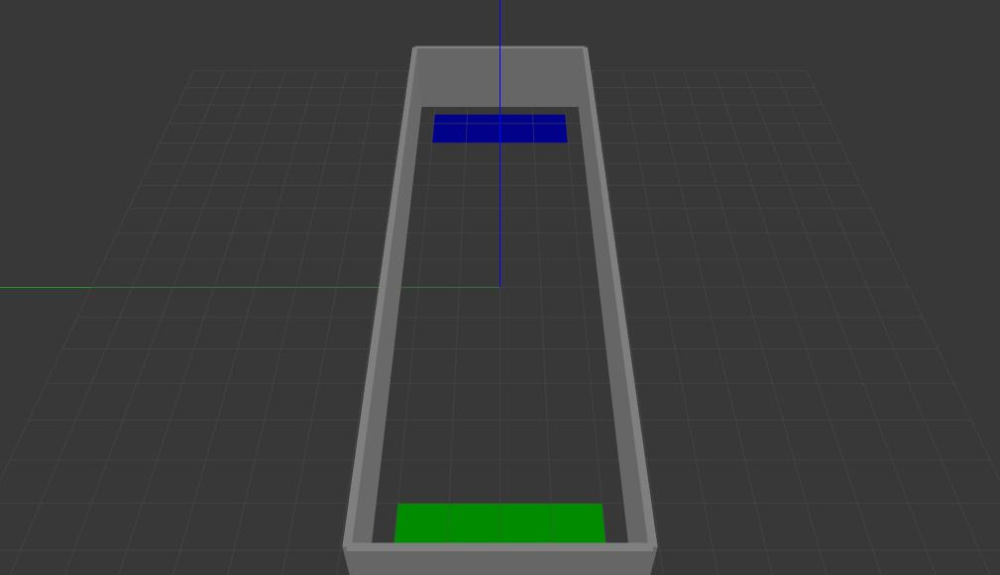
  <p>A simple room with start(green) and goal(blue) regions used for navigation purpose.</p>
</div>

* **simple_room__boxes**
<div class="crop">
  <figure align="center">
  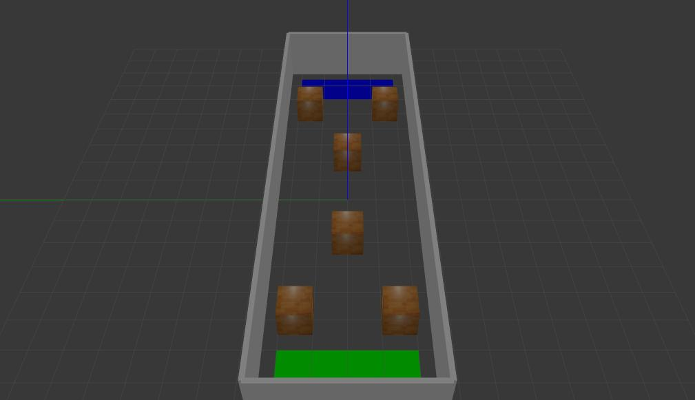
  <p>A simple room with 6 boxes as obstacles.</p>
</div>

* **simple_room__narrow_corridors**
<div class="crop">
  <figure align="center">
  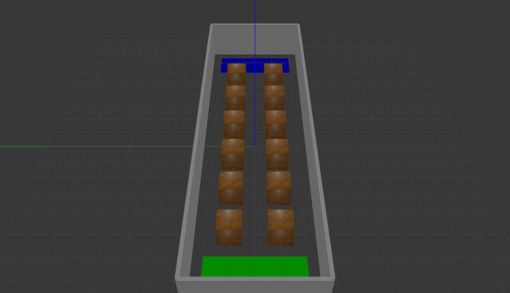
  <p>A simple room with 12 boxes forming narrow corridors.</p>
</div>

* **simple_room__tables**
<div class="crop">
  <figure align="center">
  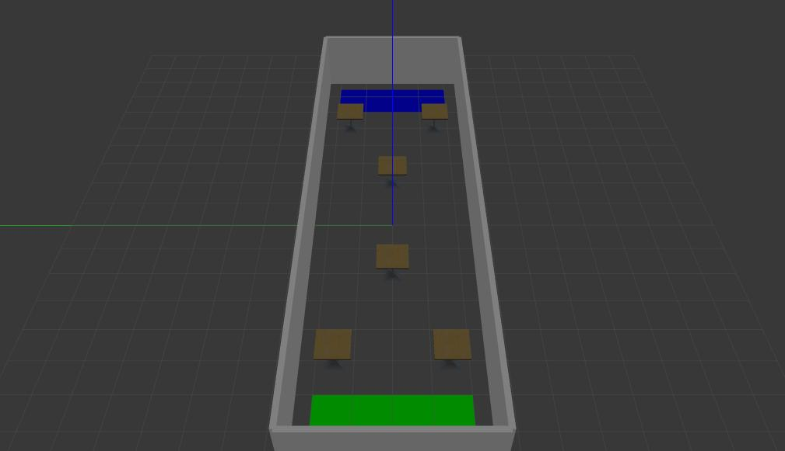
  <p>A simple room with 6 tables (hard to see by a laser).</p>
</div>

* **simple_room__boxes_small**
<div class="crop">
  <figure align="center">
  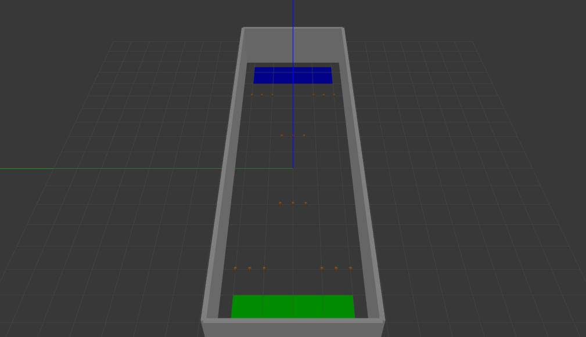
  <p>A simple room with 6 sets with 3 small boxes (10cm height, hard to see by a laser).</p>
</div>

* **simple_room__mix_1**
<div class="crop">
  <figure align="center">
  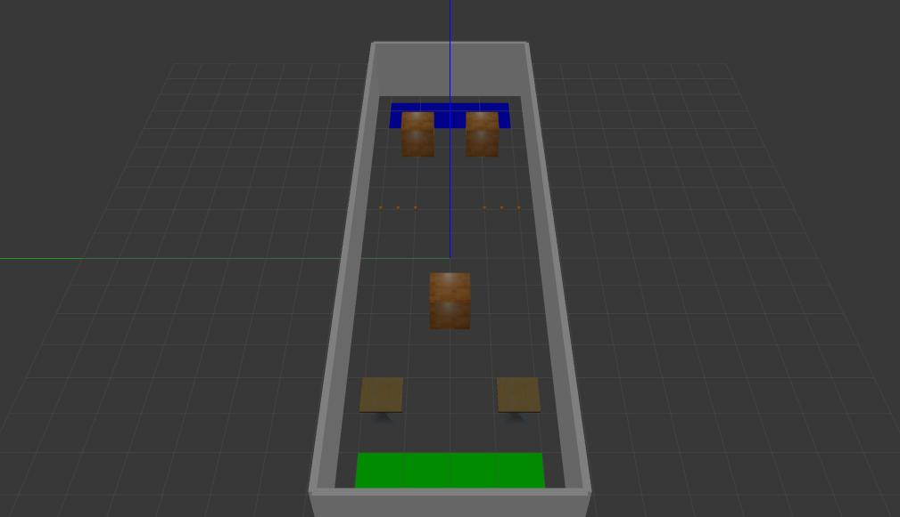
  <p>A simple room with a mix of boxes, tables, narrow corridor and small boxes.</p>
</div>

* **simple_room__static_people**
<div class="crop">
  <figure align="center">
  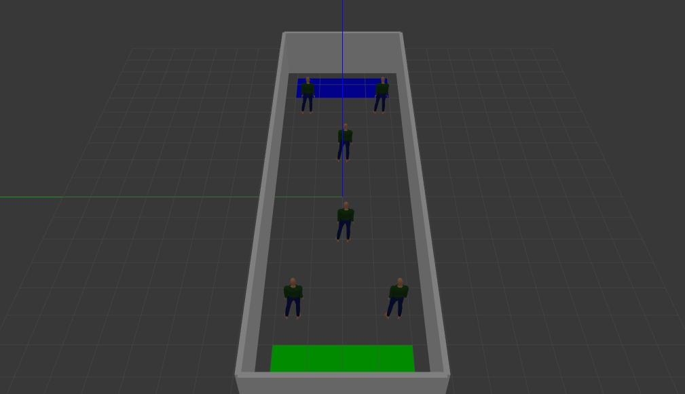
  <p>A simple room with 6 static persons.</p>
</div>

* **simple_room__dynamic_people**
<div class="crop">
  <figure align="center">
  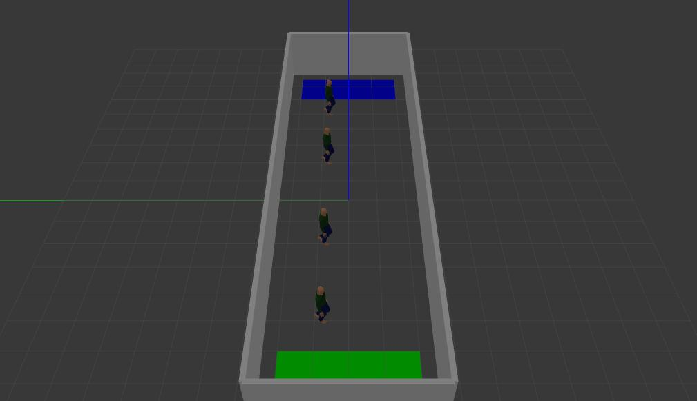
  <p>A simple room with 4 dynamic persons.</p>
</div>

* **simple_room__mix_2**
<div class="crop">
  <figure align="center">
  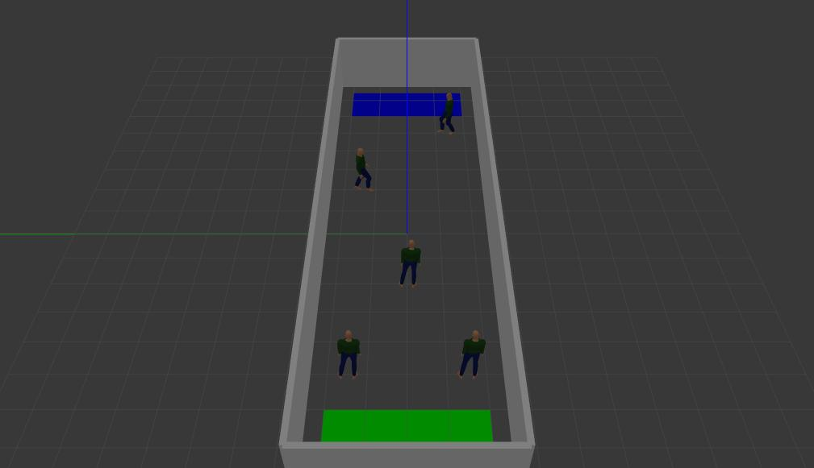
  <p>A simple room with 3 static persons and 2 dynamic persons.</p>
</div>

* **simple_room__interaction_object**
<div class="crop">
  <figure align="center">
  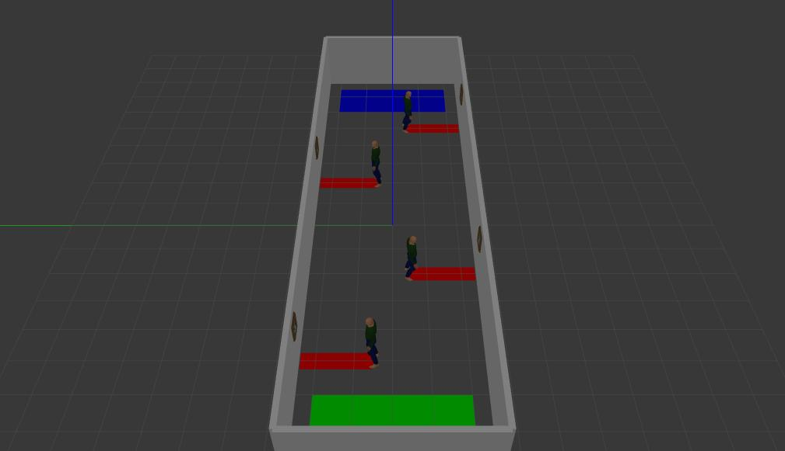
  <p>A simple room with 4 static persons looking to a object (picture) in the wall and forbidden(red) regions used for navigation purpose.</p>
</div>

* **simple_room__interaction_people**
<div class="crop">
  <figure align="center">
  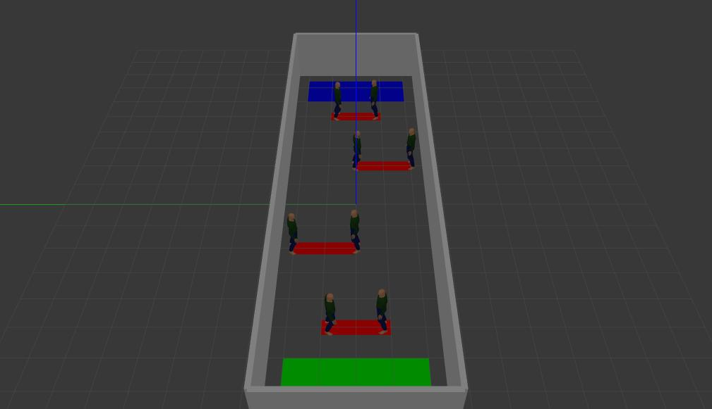
  <p>A simple room with 4 pairs of static persons looking to each others and forbidden(red) regions used for navigation purpose..</p>
</div>

* **simple_room__mix_3**
<div class="crop">
  <figure align="center">
  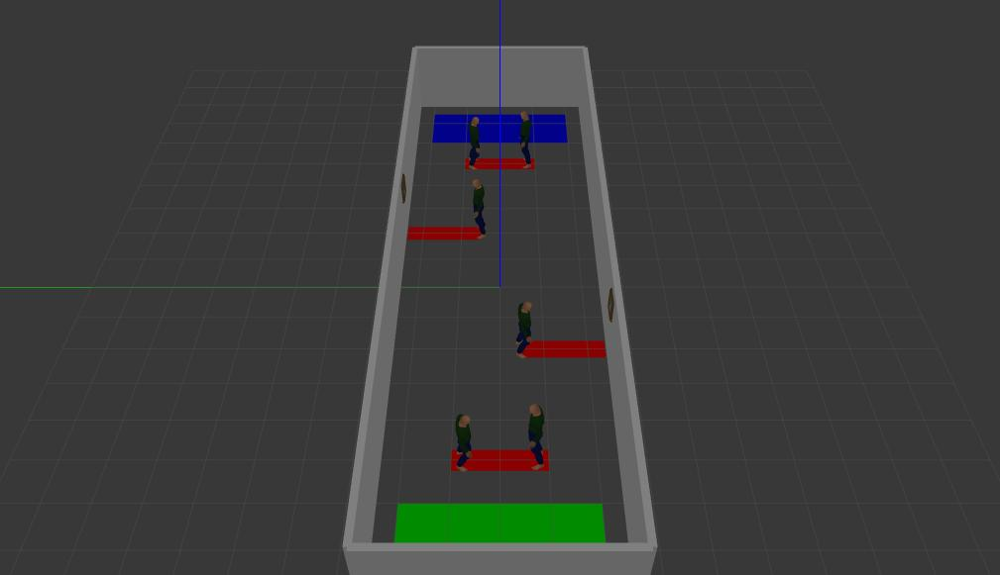
  <p>A simple room.</p>
</div>

* **robocup_2019**
<div>
  <figure align="center">
  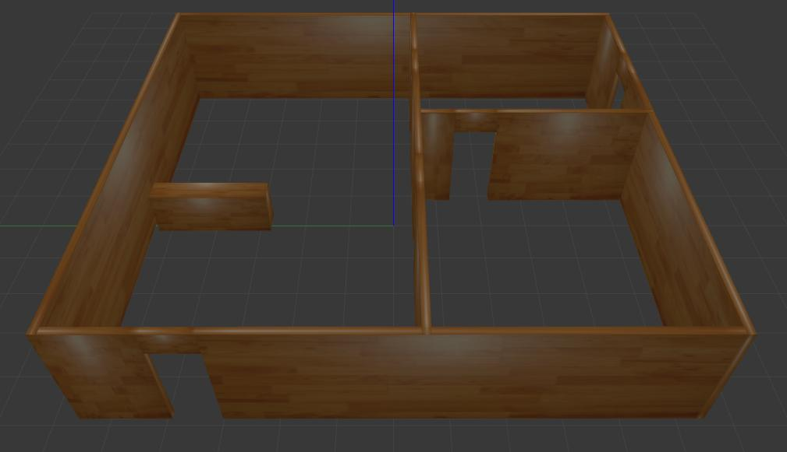
  <p>A representation of the 2019 RoboCup@home arena.</p>
</div>

* **robocup_2019__receptionist**
<div>
  <figure align="center">
  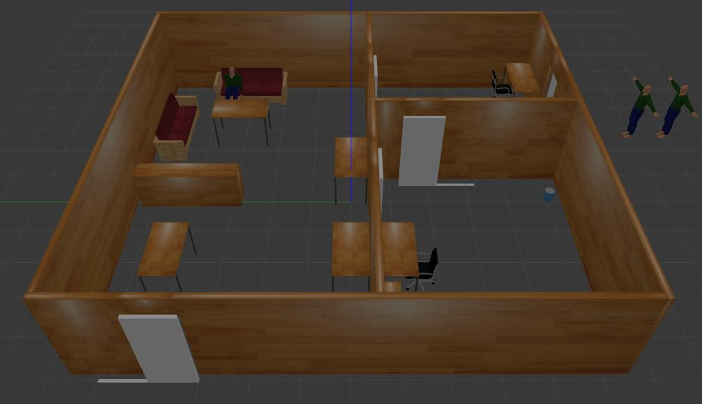
  <p>A representation of the 2019 RoboCup@home arena with objects and people used in the receptionist task.</p>
</div>

* **fei_k5**
<div>
  <figure align="center">
  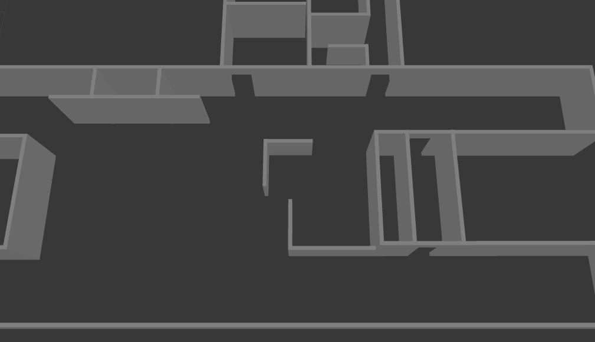
  <p>A representation of test environment located at FEI University Center.</p>
</div>

* **fei_k5__marathon**
<div>
  <figure align="center">
  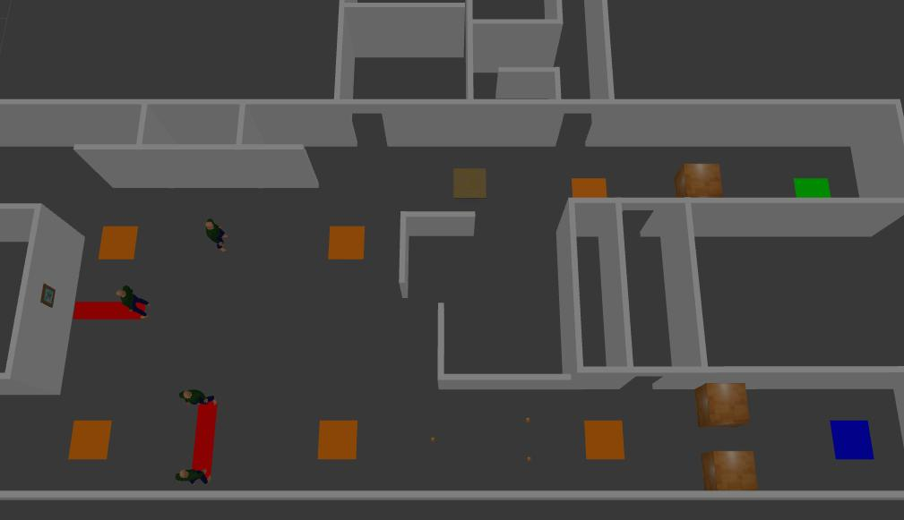
  <p>A representation of test environment located at FEI University Center and used for a robot marathon.</p>
</div>


## How to use this package:

Launch files used to start the package functionalities.
```
  |-- launch
    |--start_world.launch
    |--check_regions_test.launch
    |--real_time_factor_publisher_test.launch
```
* **start_world**: Used to start a world in the package. Parameters:
  * **world_name**: (string, default: empty) - World name.
  * **enable_gui**: (bool, default: true) - Use or not the gazebo GUI (gzclient).
  * **paused**: (bool, default: false) - Start simulation paused or not.
  Ex.:
  ```
    roslaunch social_worlds start_world.launch world_name:=robocup_2019__receptionist
  ```

* **check_regions_test**: Used to test check_region_node:
  * **world_name**: (string, default: simple_room) - World name.
  * **region_name**: (string, default: path) - Region to be checked.
  Ex.:
  ```
    roslaunch social_worlds check_region_test.launch world_name:=simple_room region_name:=path
    rostopic echo /check_path
  ```

* **real_time_factor_publisher_test**: Used to test the real_time_factor publisher.
  * **world_name**: (string, default: simple_room) - World name.
  Ex.:
  ```
    roslaunch social_worlds real_time_factor_publisher_test.launch
    rostopic echo /real_time_factor
  ```


<!--


# referências
http://data.nvision2.eecs.yorku.ca/3DGEMS/
https://github.com/srl-freiburg/pedsim_ros
http://pedsim.silmaril.org/

<plugin name="auto_sliding_door_1" filename="libauto_sliding_door.so">
  <door_name>door1</door_name>
</plugin>

-->


<!-- # Start recepcionist task
rosservice call /task_control/recepcionist/start "{}"

# usado para publicar uma nova posição do ator no gazebo
rostopic pub --once /actor_control/<actor_name>/pose geometry_msgs/Pose ...

# usado para abrir uma porta
rostopic pub --once /sliding_door_control/<door_name>/command std_msgs/String "data: 'open'"

# usado para fechar uma porta
rostopic pub --once /sliding_door_control/<door_name>/command std_msgs/String "data: 'close'"


## TODO:
Passar subscribers para services ou actions
sliding_door com exclusão de colisão no cenário e centralizado no vão da porta
ActorControl.msg -> passa std_msgs/String para string
melhorar performance temporal
trocar skin do actor dinamicamente
passar forniture de fei_k5_forniture para models
adicionar regiões -->
